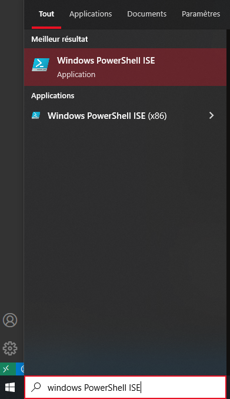
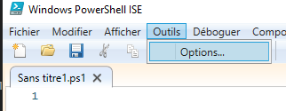
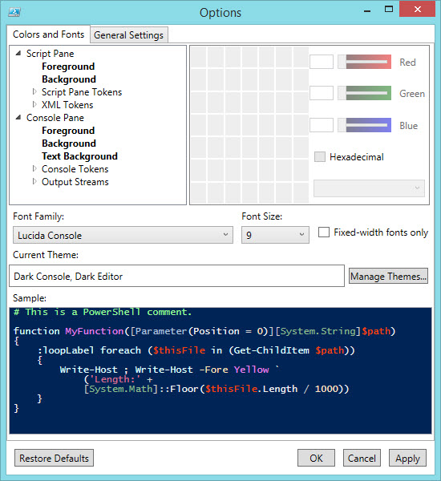
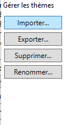
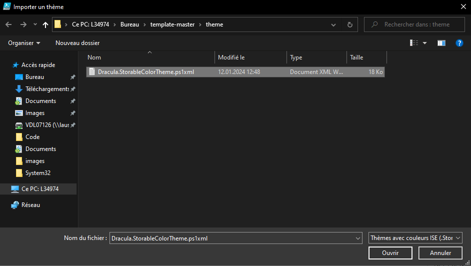

### [PowerShell ISE](https://learn.microsoft.com/en-us/powershell/scripting/windows-powershell/ise/introducing-the-windows-powershell-ise?view=powershell-7.4)

#### Install using Git

If you are a git user, you can install the theme and keep up to date by cloning the repo:

```bash
git clone https://github.com/dracula/PowerShell-ISE.git
```

#### Install manually

Download using the [GitHub `.zip` download](https://github.com/dracula/PowerShell-ISE/archive/master.zip) option and unzip them.

#### Activating theme

1. Open windows PowerShell ISE
- 
2. Navigate to Tools > Options > Colors and Fonts > Manage Themes.
- 
- 
3. click Import
- 
4. Go to the location of the . xml file and click open
- 
5. Finally press ok, then apply and ok to apply the theme to the script and cosole